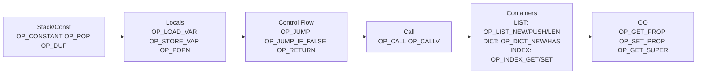
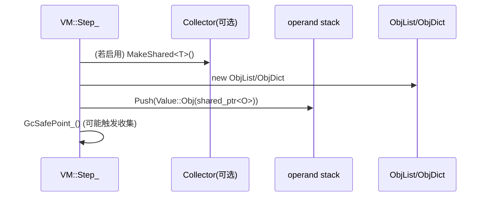

# 后端线图（Bytecode VM / Runtime / GC）

这份文档专门服务“后端面试向”复盘：把 **字节码有哪些、每条字节码在 VM 怎么跑、运行时状态如何变化、对象/GC 如何耦合** 用“线连着的图”画出来。后续我们每捋一个后端模块，就把对应线图补在这里。

---

## 如何把这份线图渲染成“线连着的图”

- 方案 A（最快）：复制下面的 `mermaid` 代码块到 https://mermaid.live 直接渲染
- 方案 B（本地 IDE）：如果你的 Markdown 预览不显示图，安装一个支持 Mermaid 的 Markdown 预览插件后重新打开预览
- 方案 C（代码托管）：GitHub 会原生渲染大多数 Mermaid 图（直接打开该 md 即可）

---

## 1. 后端模块边界（你回答“后端由哪些模块组成”用这张图）

```mermaid
flowchart LR
  subgraph BC[字节码表示层]
    Op[opcodes.h<br/>OpCode 枚举]
    Fn[function.h<br/>Function(arity, LocalCount, Chunk)]
    Ch[chunk.h<br/>Chunk(code, consts, lines)]
  end

  subgraph RT[运行时解释器]
    VM[vm.cc<br/>VM::Run/Step_]
    Stack[stack_stats<br/>operand stack]
    Frames[call_frame<br/>CallFrame(ip, locals)]
    Callables[vm.h<br/>callables_ 表]
  end

  subgraph MODEL[运行时数据模型]
    Val[value.h<br/>Value(variant)]
    Obj[object.h<br/>ObjList/Dict/Class/Instance/BoundMethod]
  end

  subgraph GC[GC]
    GcObj[gc_object.h<br/>GcObject(mark,next,Trace)]
    Col[gc.cc<br/>Collector(Mark/Drain/Sweep)]
    Roots[vm.cc<br/>VM::TraceRoots]
  end

  Op --> VM
  Fn --> VM
  Ch --> VM

  VM --> Stack
  VM --> Frames
  VM --> Callables

  Stack --> Val
  Frames --> Val
  Val --> Obj
  Obj --> GcObj
  Roots --> Col
  VM --> Roots
```

---

## 2. VM 执行模型（你回答“VM 的不变量/运行时状态”用这张图）

```mermaid
flowchart TB
  subgraph S[VM 状态]
    IP[ip: CurrentFrame().ip]
    F[frames_: vector<CallFrame>]
    L[locals_: vector<Value>]
    ST[stack_: vector<Value>]
    CH[chunk: code + consts]
  end

  IP -->|取指| CH
  CH -->|opcode/operand| ST
  ST -->|load/store| L
  L -->|属于| F

  note1["不变量：<br/>1) ip 指向当前帧的 chunk code index<br/>2) 局部变量都在 locals_ 槽位数组里<br/>3) 所有中间值都在 operand stack 上<br/>4) opcode 的数据流以 Push/Pop 为主"]
  S --- note1
```

---

## 3. 字节码分组（你回答“后端实现了哪些字节码”用这张图）



---

## 4. 典型“对象创建”路径（只是后端问题的一类示例）

### 4.1 list/dict：由 opcode 直接创建



### 4.2 class 调用：由 OP_CALLV 的 class 分支创建 instance

```mermaid
flowchart TB
  CallV[OP_CALLV] -->|callee.IsClass()| NewFields[创建 fields: ObjDict]
  NewFields --> NewInst[创建 instance: ObjInstance(klass, fields)]
  NewInst --> FindInit[klass->GetMethodIndex('init')]
  FindInit -->|无 init| RetInst[Push(instance)]
  FindInit -->|有 init| CallInit[argv2[0]=this 注入后 DoCallByIndex(init)]
  CallInit --> MarkReturn[frames_.back().return_instance = true<br/>instance_to_return = instance]
  MarkReturn --> RetFromInit[OP_RETURN 时覆盖返回值为 instance]
```

